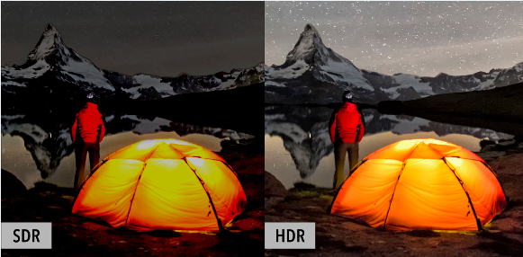

# HDR이란

URL: https://estla.co.kr/QnA/?q=YToyOntzOjQ6InBhZ2UiO2k6MjtzOjEyOiJrZXl3b3JkX3R5cGUiO3M6MzoiYWxsIjt9&bmode=view&idx=3640193&t=board

HDR(High Dynamic Range)은 밝은 곳은 더 밝게, 어두운 곳은 더 어둡게 만들어

사람이 실제 눈으로 보는 것에 가깝도록 밝기의 범위(Dynamic Range)를 확장시키는 기술입니다.

예를 들어 어두운 동굴 장면에서 HDR이 적용된 TV는 동굴 벽의 질감뿐만 아니라 모양과 색까지 실감나게 전달합니다.

햇빛이 눈부시게 쏟아지는 바다 위를 요트가 지나가는 장면에서도 햇살 하나하나를 선명하게 보여줄 수 있습니다.
