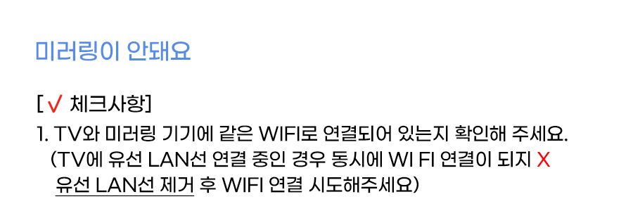
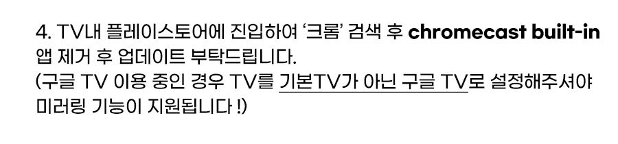

# 미러링이 안돼요

URL: https://estla.co.kr/selftest/?q=YToyOntzOjQ6InBhZ2UiO2k6MztzOjEyOiJrZXl3b3JkX3R5cGUiO3M6MzoiYWxsIjt9&bmode=view&idx=15367415&t=board

[구글홈](https://youtu.be/oNs4SzHnNHE)

[앱을 통한 미러링 기능](https://youtu.be/R8zIwiU1E1s)

[기본TV→구글TV 변경 법 링크](https://www.youtube.com/watch?v=oabEGon0AsQ)

[↑ 자세히 알아보기 (리눅스 모델 스크린 캐스트 영상 링크)](https://www.youtube.com/watch?v=5DFnBKlWt_E)

이미지 클릭 시 카카오톡 채널로 연동됩니다.
