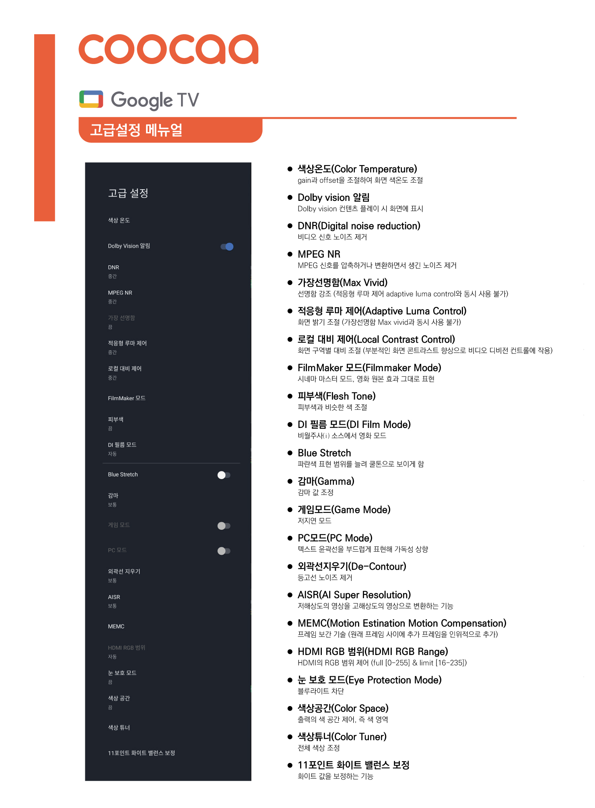

# 화면 고급설정이 궁금해요

URL: https://estla.co.kr/selftest/?q=YToyOntzOjQ6InBhZ2UiO2k6MTtzOjEyOiJrZXl3b3JkX3R5cGUiO3M6MzoiYWxsIjt9&bmode=view&idx=18622093&t=board

▲ UCQLED SMART THE MAXIMUM / UCMLED SMART THE MAXIMUM 화면 고급설정 설명

[AN(AU)UHD SMART THE ULTRA 모델 고급동영상 화면 설정](https://youtu.be/-fkj_k9CzXU?si=-M3gyL3tXADIB2H3)링크

[AN(AU)UHD SMART THE ULTRA 게임모드, PC모드 설정 링크](https://youtu.be/TQk9Hv3Be4E?si=kkh-9dhISrOyCTKx)

[UC UHD THE SMART AI PRO 화면 설정 링크](https://youtu.be/lJINp97BcnY?si=1-7iR_rO_9BjtG5_)

[AN(AU)UHD ANDROID THE SMART AI 화면 설정 링크](https://youtu.be/r7AQwkRBPlE?si=qBXqhuWbBktHIgu7)

[UC UHD SOUND THE SMART AI 화면 설정 링크](https://youtu.be/AEPszrcuWRs?si=pxP8xubhZKpBoMi_)

[AA UHD THE SMART PRO 화면 설정](https://youtu.be/U-uf0kuhXx4?si=MHATXeuW2Q-xJH1y)
